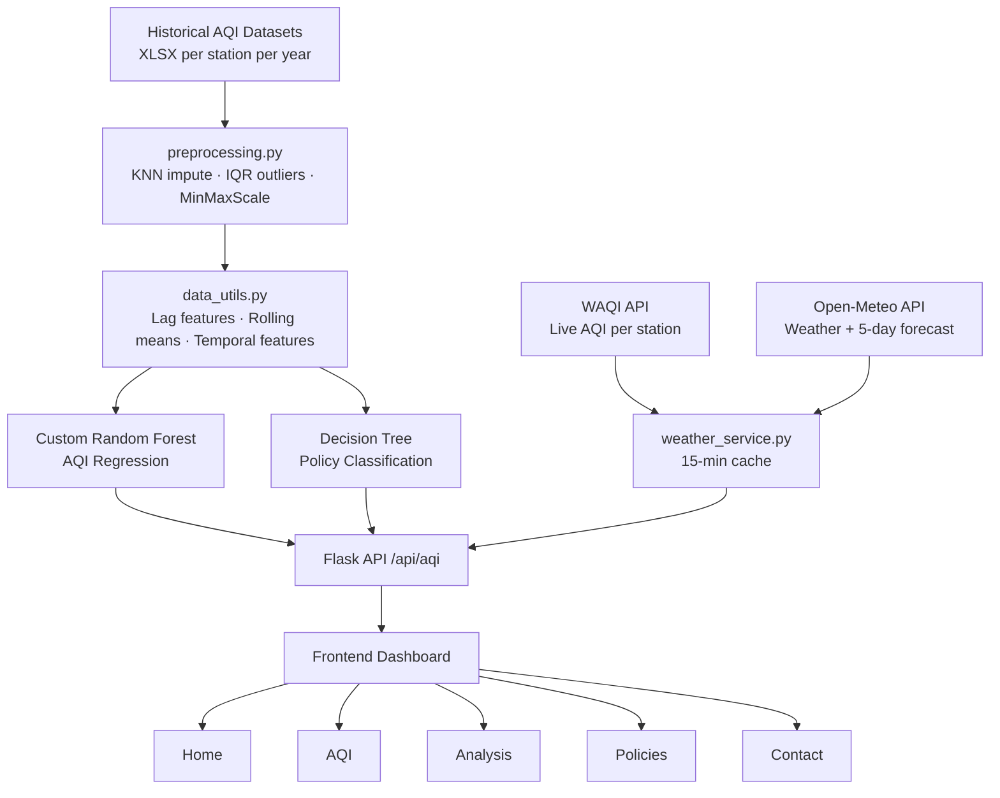

# EcoAware — Delhi AQI Monitoring & Policy Dashboard

Real-time air quality monitoring for 20 Delhi stations with two ML models: a lag-based AQI predictor and a policy classifier that recommends government interventions based on pollution levels.

Flask backend, vanilla HTML/CSS/JS frontend, custom-built Random Forest + Decision Tree — no sklearn for the core models.

---

## System Architecture



---

## What it does

- Monitors AQI live across **20 Delhi stations** (Anand Vihar, DTU, ITO, IGI Airport T3, etc.) via WAQI API
- Pulls real-time weather (temperature, humidity, wind, pressure, 5-day forecast) from Open-Meteo per station
- Predicts next-day AQI using a **custom Random Forest** trained on lag + weather features
- Classifies pollution into **7 policy levels** using a Decision Tree — recommends actions like GRAP Stage 3/4, odd-even vehicle policy, construction suspension, etc.
- 5-page dashboard: Home, AQI, Analysis, Policy Insights, Contact

---

## ML Models

### Model 1 — AQI Regressor (Custom Random Forest)

**Input features** (lag-based, not raw pollutants):

| Feature | Description |
|---------|-------------|
| lag_1, lag_2, lag_3, lag_7 | Previous day AQI values |
| rolling_mean_3, rolling_mean_7 | 3-day and 7-day rolling averages |
| temp_lag_1, temp_rolling_mean_3 | Temperature lag features |
| month, day, day_of_week, day_of_year | Temporal features |

80/20 temporal train/test split. Predicts next-day average AQI.

### Model 2 — Policy Classifier (Decision Tree)

Maps AQI ranges to 7 government intervention levels:

| Policy Level | AQI Range | Action |
|-------------|-----------|--------|
| 0 | ≤ 50 | No special action |
| 1 | 51–100 | GRAP Stage 3/4 measures |
| 2 | 101–200 | Odd-even vehicle policy |
| 3 | 201–300 | Industrial checks + fines |
| 4 | 301–400 | Water sprinkler enforcement |
| 5 | 401–500 | Suspend outdoor / schools online |
| 6 | > 500 | Suspend construction temporarily |

---

## Data Pipeline

```
Raw XLSX files (per station, per year)
    → load_and_merge_data()     # regex parse filenames, melt to long format
    → clean_data()              # KNN imputation (k=5)
    → process_date()            # Day + Month → DOY (day of year)
    → encode_data()             # 20 station names → integer codes
    → handle_outliers()         # IQR clipping (1.5×)
    → scale_data()              # MinMaxScaler → saved as .pkl
    → build_training_frame()    # lag + rolling features + target shift
```

---

## Tech Stack

| Layer | Tools |
|-------|-------|
| Backend | Python, Flask |
| Frontend | HTML5, CSS3, Vanilla JS |
| ML | Custom Random Forest, Decision Tree (no sklearn for models) |
| Data processing | Pandas, NumPy, scikit-learn (preprocessing only) |
| Live data | WAQI API (AQI), Open-Meteo (weather + forecast) |
| Caching | In-memory 15-min TTL per station |

---

## Project Structure

```
ecoaware-project/
├── backend/
│   ├── api/
│   │   ├── server.py              # Flask routes
│   │   ├── aqi_service.py         # Page context builders
│   │   └── weather_service.py     # WAQI + Open-Meteo fetcher (cached)
│   └── utils/
│       ├── aqi_utils.py           # classify_aqi, colors, advice
│       ├── chart_utils.py         # Chart data builders
│       ├── data_utils.py          # Data loaders + feature engineering
│       ├── formatters.py          # Safe number/date/station formatters
│       └── station_config.py      # 20 station coordinates + default
├── ml_pipeline/
│   ├── preprocessing.py           # Full data cleaning pipeline
│   ├── model_training.py          # Train + save RF regressor
│   ├── model_testing.py           # Evaluate both models
│   └── custom_models/
│       ├── random_forest.py       # Custom RF implementation
│       └── metrics.py             # MAE, RMSE, R², precision, recall, F1
├── datasets/
│   ├── Data_training/             # Raw XLSX files per station/year
│   ├── Merged_all_readable.csv    # Merged readable dataset
│   └── Merged_all_scaled.csv      # Scaled dataset
├── training/
│   ├── aqi_regressor.pkl          # Saved RF model
│   └── data_scaler_aqi.pkl        # Saved scaler
├── templates/                     # Jinja2 HTML templates
└── static/                        # CSS + JS
```

---

## Setup

```bash
git clone https://github.com/nishika070/ecoaware.git
cd ecoaware-project

pip install -r requirements.txt

# Train the model first (only needed once)
python ml_pipeline/model_training.py

# Start the server
python backend/api/server.py
# → http://127.0.0.1:5000
```

---

## Routes

| Route | Page |
|-------|------|
| `/` | Home — station overview + live weather |
| `/aqi` | AQI dashboard — trends, predictions |
| `/analysis` | Analysis — charts, station comparison |
| `/policies` | Policy insights |
| `/contact` | Contact |
| `/api/aqi` | JSON — live AQI + model prediction |

---

*JIIT Noida · B.Tech CSE · 2024–2028*
