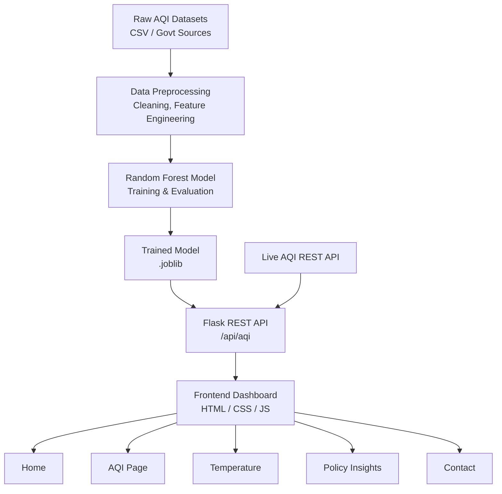

# EcoAware — Delhi Climate & AQI Monitoring Dashboard

Delhi-focused environmental monitoring system with an ML-based AQI predictor, live data integration, and a 5-page interactive dashboard.

Built solo as part of a college project. Python + Flask backend, vanilla HTML/CSS/JS frontend, Random Forest model trained on multi-year Delhi pollution data.

---

## System Overview



---

## What it does

- Predicts Delhi's AQI from pollutant readings (PM2.5, PM10, NO2, SO2, CO, O3) using a trained Random Forest model
- Pulls live air quality data via REST API and displays it in real time
- 5-page dashboard covering AQI trends, temperature patterns, and policy impact analysis
- Color-coded AQI indicators (Good → Hazardous) across all views

---

## Tech Stack

| Layer | Tools |
|-------|-------|
| Backend | Python, Flask |
| Frontend | HTML5, CSS3, Vanilla JS |
| ML | Scikit-learn, Pandas, NumPy |
| Model | Random Forest Regressor |
| Data | Historical CSV datasets + live AQI API |

---

## ML Pipeline

```
Raw Data → Preprocessing → Feature Engineering → Train/Test Split → RF Model → Evaluation → API
```

**Preprocessing steps:** missing value imputation, outlier capping, normalization, temporal feature extraction (season, month, day-of-week)

**Model performance:**

| Metric | Value |
|--------|-------|
| R² Score | 0.76 |
| MAE | 12.4 |
| RMSE | 18.7 |
| Precision | 0.74 |
| Recall | 0.78 |

---

## Project Structure

```
ecoaware/
├── backend/
│   ├── api/server.py              # Flask app + routing
│   └── models/
│       ├── random_forest_model.joblib
│       └── decision_tree_model.joblib
├── frontend/
│   ├── index.html / aqi.html / temperature.html
│   ├── policy.html / contact.html
│   ├── css/styles.css
│   └── js/app.js
├── ml_pipeline/
│   ├── data_preprocessing.py
│   ├── model_training.py
│   └── evaluation.py
├── datasets/
│   ├── Data_training/AQI_merged_all.csv
│   └── delhi25-26.csv
└── requirements.txt
```

---

## Setup

```bash
git clone https://github.com/nishika070/ecoaware.git
cd ecoaware
pip install -r requirements.txt
python backend/api/server.py
# open http://127.0.0.1:5000
```

---

## API

| Endpoint | Method | Returns |
|----------|--------|---------|
| `/api/aqi` | GET | Current AQI + prediction |
| `/api/aqi/historical` | GET | Historical trend data |
| `/api/temperature` | GET | Temperature + correlation |

---

## Contributions

**Nishika Chaudhary (nishika070)** — everything: data pipeline, ML model, Flask backend, all 5 frontend pages, visualizations, API integration

---

## Note

Model auto-trains on startup if no `.joblib` file is found. To retrain on scaled data:
```bash
python ml_pipeline/model_training.py --scaled datasets/delhi25-26.csv
```

---

*JIIT Noida · B.Tech CSE · 2024–2028*
